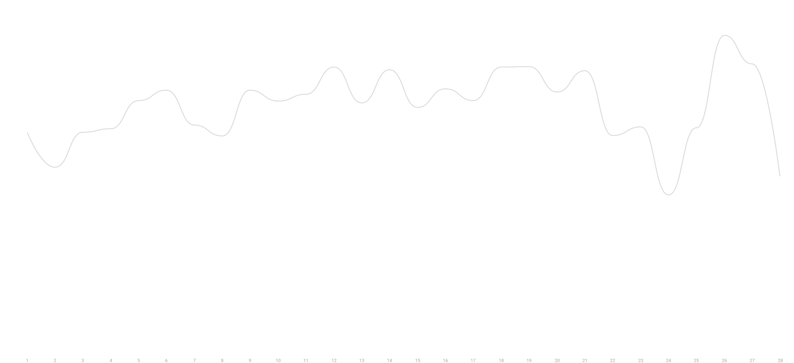
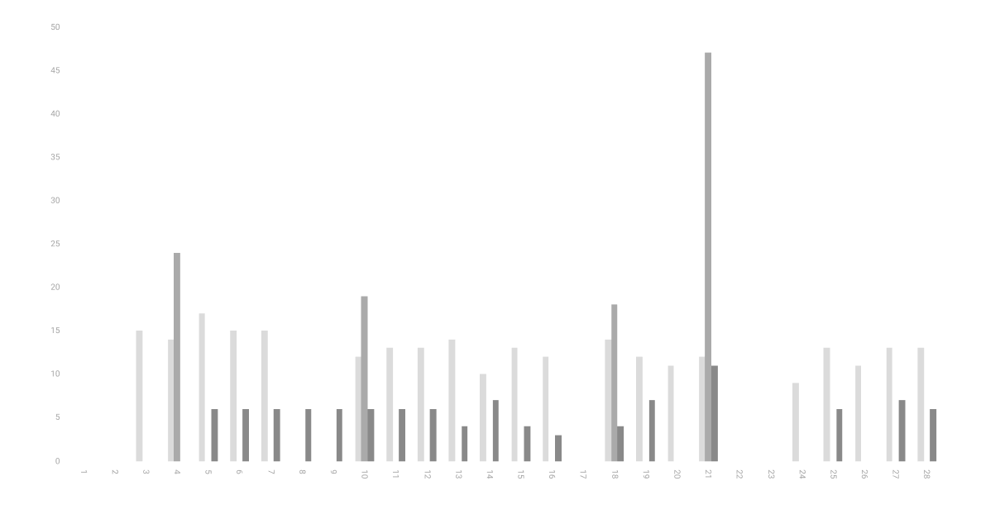

This is my first quantifying project. The main reason to do this is to track my time and be more present. This project require dedication to build. It makes more more disciplined throughout the month.

I am currently using [airtable](https://airtable.com), [notion](https://notion.so), [Apple Watch](https://www.apple.com/id/watch/), [IFTTT](https://ifttt.com/), [Strava](https://strava.com), and [Last FM](https://last.fm) to track everything.

Hopefully I can improve the way I track and present every single month. I still have some ideas on what to track and haven't found a way to track it yet.

---

#### 📱 *Daily screen time average:* `4h`

#### 🗣 *Total media consumption time:* `39.51h`

#### 🛌*Average sleep time:* `7.17h`

#### 🏃🏻‍♂️ *Distance ran:* `45.66km`

#### 🏋🏻‍♀️ *Time spent working out:* `7.47h`

First line indicate running, second line is lifting weight, and the third line is walking.

Mostly I don't workout on the weekend, things will change in March. I am planning to keep working out on the weekend.

### 🎤 Top artist

- *Justin Bieber* (212 plays)
- *John Mayer* (124 plays)
- *Eminem* (60 plays)
- *Leeland* (43 plays)
- *Ed Sheeran* (40 plays)

### 📚 Books Progress

#### January

*Factfulness* - Hans Rosling

  

    

  

  100%

*Make Time* - Jake Knapp

  

    

  

  100%

*Atomic Habits* - James Clear

  

    

  

  100%

#### February

*Rework* - Jason Fried

  

    

  

  100%

*It Doesn't Have to be Crazy at Work* - Jason Fried

  

    

  

  100%

*Shoe Dog* - Phil Knight

  

    

  

  40%

*Never Eat Alone* - Keith Ferrazzi

  

    

  

  25%

*How Not To Be Wrong* - Jordan Ellenberg

  

    

  

  35%

### 📺 TV Show Progress
*Breaking Bad*

  

    

  

  75%

*The Stranger*

  

    

  

  100%

*Friends*

  

    

  

  100%

*Seinfeld*

  

    

  

  3%

*Narcos*

  

    

  

  7%

*Rick and Morty*

  

    

  

  36%

### 👓 Favorite articles

- [Overwhelmed is a Choice](https://seths.blog/2020/02/overwhelmed-is-a-choice/) - *Seth Godin*
- [Circle of Competence](https://fs.blog/2013/12/circle-of-competence/) - *Farnam Street*
- [Focus is for Winners](https://themargins.substack.com/p/focus-is-for-winners) - *The Margins* 

### 🎤 Favorite Podcast

- [Be a Platform](https://mastersofscale.com/tobi-lutke-be-a-platform/) - *Masters of Scale*
- [Minimalist Business](https://open.spotify.com/episode/4DrtQ2TCTLF9QowKEDTOGX?si=so5Txc-QSaesJCW6HtpG9g) - *The Minimalist Podcast*
- [Naval Ravikant: The Angel Philosopher](https://open.spotify.com/episode/5W0RQCDr28VSxVZOYJn3f5?si=z91n2I6OS0-fgcrSEl0F2g) - *The Knowledge Project*

### 🗒 Favorite quote

> #### What is the ultimate quantification of success? 
>
> It is not how much time you spend on the things you love, but how little time you don't spend doing what you hate. - Casey Neistat

