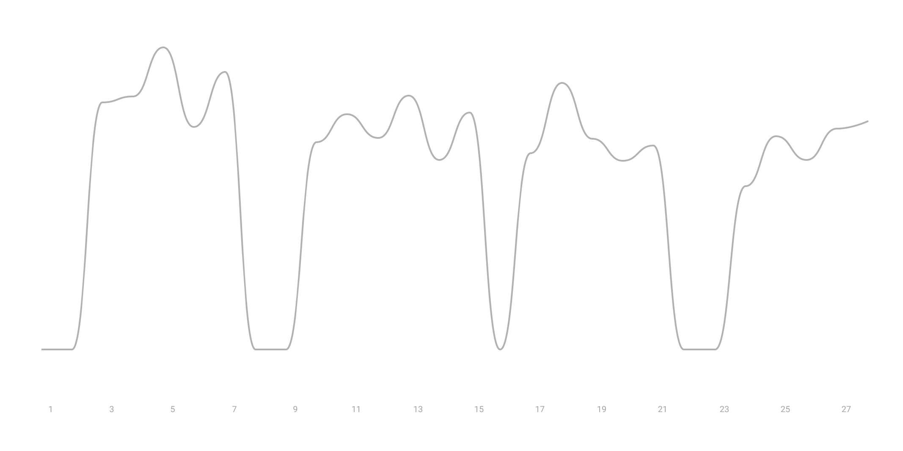

#### 📱 *Daily screen time average:* `4:07h`

#### 🗣 *Total media consumption time:* `39:51h`

#### 🛌*Average sleep time:* `7:10h`

#### 🏃🏻‍♂️ *Distance ran:* `24.7km`

#### 🏋🏻‍♀️ *Time spent working out:* `7.47h`

First line indicate running, second line is lifting weight, and the third line is walking.

Mostly I don't workout on the weekend, things will change in March. I am planning to keep working out on the weekend.

### 🎤 Top artist

- *Justin Bieber* (312 plays)
- *Twice* (156 plays)
- *John Mayer* (65 plays)
- *Post Malone* (30 plays)
- *Eminem* (21 plays)

### 📚 Books Progress

*Shoe Dog* - Phil Knight

  

    

  

  100%

### 📺 TV Show Progress
*Breaking Bad*

  

    

  

  
100%

### 👓 Favorite articles

- [Signaling as a Service](https://julian.digital/2020/03/28/signaling-as-a-service/) - *Julian Lehr*
- [Black Swan Events](https://danco.substack.com/p/black-swan-events) - *Alex Danco*
- [The Antilibrary: Why Unread Books Are The Most Important](https://fs.blog/2013/06/the-antilibrary/) - *Farnam Street* 

### 🎤 Favorite Podcast

- [Matt Clifford - Investing Pre-Company](https://podcasts.apple.com/us/podcast/matt-clifford-investing-pre-company-invest-like-best/id1154105909?i=1000462456930) - *Invest Like the Best*
- [How to Get Rich: Every Episode](https://nav.al/rich) - *Naval*

### 🗒 Favorite quote

> #### What is the ultimate quantification of success? 
>
> It is not how much time you spend on the things you love, but how little time you don't spend doing what you hate. - Casey Neistat

