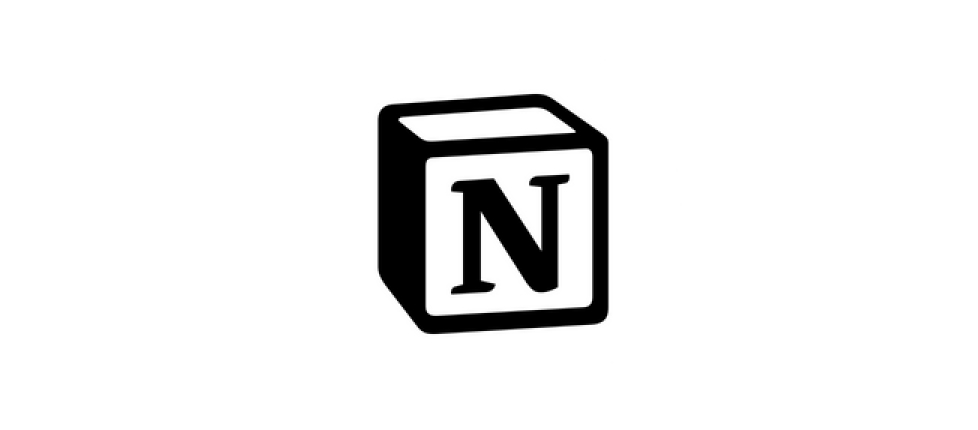
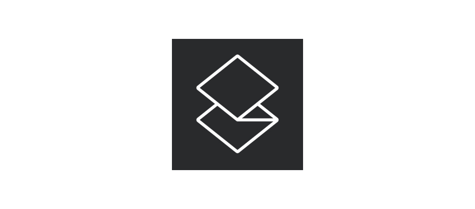
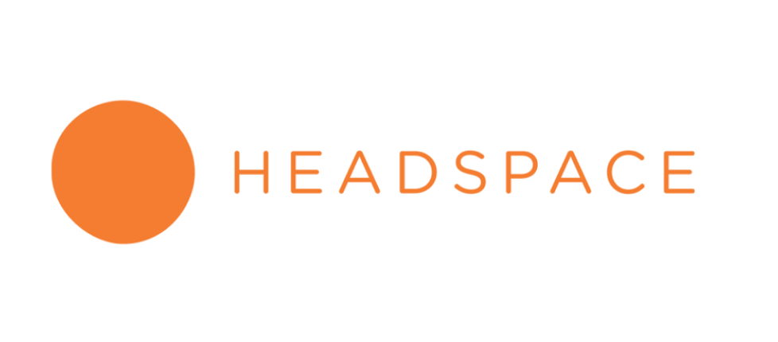
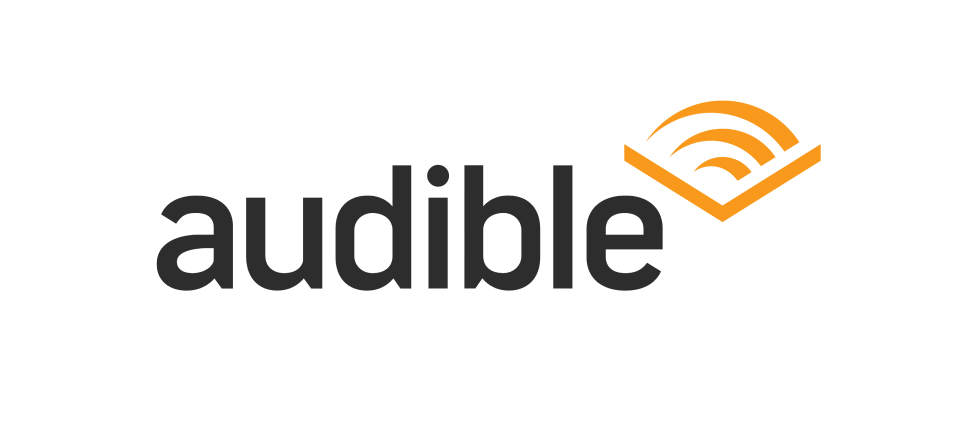

We can't deny that some of our work rely on certain applications.
Some apps are free and some apps are not. I love discovering new applications out there. It feels nice to explore the app store and find a new apps that can help me become more productive. Here are some of the applications that I love and pay for:

## [Notion](https://notion.so)

I used to love Evernote. I put all of my notes there and I did not have any intentions to leave it. One day I discovered Notion from Twitter and Youtube. It is a really promising app.
 
What not to love about the app?
 
- The UI is simple
- The UX is awesome
- The price is reasonable
- You can basically build anything with it

I really suggest you to try the app, you are not going to regret it. Notion is a free app and you can pay $5 to use their premium feature.

## [Superhuman](https://superhuman.com)

Email is amazing. But it can be haunting at the same time. I love the idea of inbox zero and it is getting harder and harder these days. I really love Inbox by Google but <a href="https://www.theverge.com/2018/9/12/17848500/google-inbox-shut-down-sunset-snooze-email-march-2019" rel="noopener noreferrer" target="_blank">Google shut it down last year</a>. I was looking for a great email client and I could not find any. 
 
Then Superhuman came out. It is really hard to get an invitation but thanks to someone on reddit I have an invitation now! I did not know that I Superhuman is a monthly subscription and I must admit that the price is quite high `($30/month)`. I have been using it for the past month and I really love it. Their shortcut makes it easier to deal with email. The split inbox feature is really awesome too!

## [Headspace](https://headspace.com)

If you followed me on <a href="https://instagram.com/juliancanderson" rel="noopener noreferrer" target="_blank">instagram</a>. You might know that I have been trying to meditate daily for the past year. I am not that good in controlling my emotion and I have read that meditation can help. I really love Headspace because it is simple and it helps me to meditate daily. Their subscription costs around `$5/month`.

## [Audible](https://audible.com)

Audible is an audio listening platform from Amazon. I love any kind of books, audio, ebook, physical. That is the main reason why I subscribed to Audible. I love how easy it is to listen to audiobook while I am commuting, working out, or running. It is like killing two birds with one stone! The subscription cost `$15/month` and you get 1 credit to buy a book each month. Some books I recommend: 
- <a href="https://www.audible.com/pd/Stillness-Is-the-Key-Audiobook/0593147952" rel="noopener noreferrer" target="_blank">Shoe Dog</a>
- <a href="https://www.audible.com/pd/Company-of-One-Audiobook/B07KFN2255" rel="noopener noreferrer" target="_blank">Company of One</a>
- <a href="https://www.audible.com/pd/Shoe-Dog-Audiobook/B01CRM17MS" rel="noopener noreferrer" target="_blank">Stillness is the Key</a>

## [1Password](https://1password.com)

Privacy is one of the most important thing right now. It is hard to keep track of our password. I used to keep them on my notes which I do not recommend. I used to have the same password for everything in case I forgot them. Right now I use 1Password to take care about everything related with password. It syncs beautifully within browser, devices, and phones. The subscription costs `$2.99/month`.

---

Those are the apps that I currently pay for. I will add more if I encounter something in the future. I hope that you find it useful!
 
What are your favorite apps that you pay for? Let me know via <a href="mailto:hello@juliancanderson.com">email</a>!