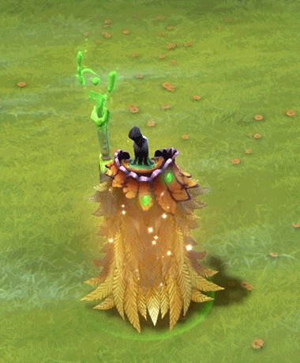
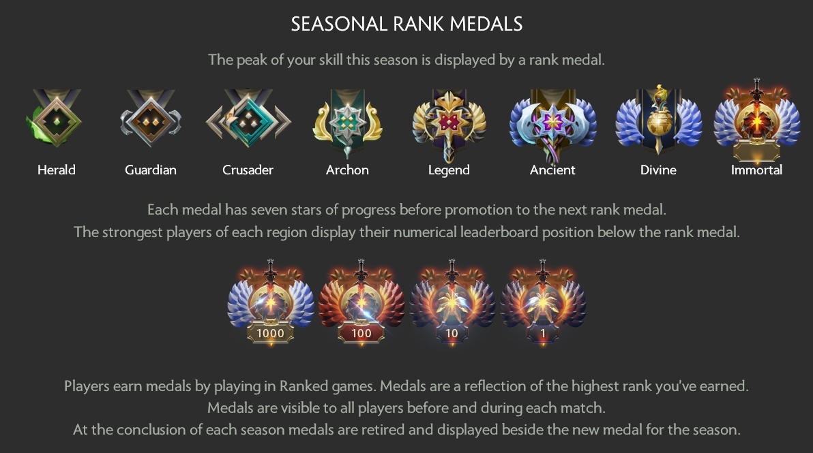
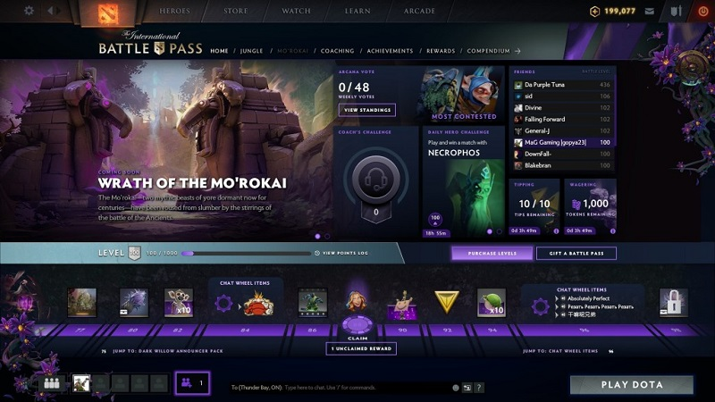

I have been into this game called DOTA2 since high school. My friends introduced me into the game and I was pretty bad at the game before because I never played this kind of game before. As I get better the game became more enjoyable for me. I have spent a lot of my time on the game, not just time but also money.

It is not a pay to win games. You don't get any buffs or advantages with the money that you spend. It might sounds silly but a lot of people do this with in game cosmetics. They want to have the latest and the best one out there. Some cosmetics are really cheap and some can cost [up to more than $1000](https://win.gg/news/4170/these-are-the-most-expensive-cosmetic-items-in-dota-2). I did not realize then that this is related to status signaling.

The company behind DOTA2 is Valve with [$10 billion valuation in 2019](https://www.bloomberg.com/billionaires/profiles/gabe-newell/#:~:text=Steam%20can%20support%20millions%20of,based%20analyst%20at%20Wedbush%20Securities.), who owns their own store called Steam.  Valve also owns some big titles such as Counter Strike Global Offensive, Half Life, and Team Fortress. 

In this blogpost we will take a deep dive into signaling in Video Games in the perspective of DOTA2.

Some resources to read more about Signaling:
- [Status as a Service by Eugene Wei](https://www.eugenewei.com/blog/2019/2/19/status-as-a-service)
- [Signaling as a Service by Julian Lehr](https://julian.digital/2020/03/28/signaling-as-a-service/)

---

## History of DOTA2
Defense of the Ancients(DOTA) began as a mod for Blizzard's Warcraft 3 in 2003. By the late 2000s, DOTA became one of the most popular mods worldwide, as well as a prominent esports game. Valve's interest in the Dota intellectual property began when several veteran employees, including Team Fortress 2 designer Robin Walker and executive Erik Johnson, became fans of the mod and wanted to build a modern sequel. Then the company was in talk with IceFrog and IceFrog announced his new position in October 2009 and Dota 2 was announced a year after that.

DOTA2 was planned to be a Social Network so in 2012 Gabe announced that it will be a free to play game. They were planning that [community contribution will be a cornerstone feature](https://web.archive.org/web/20120530235418/http://pc.gamespy.com/pc/dota-2010/1223419p1.html). And this decision paid out, by 2015, sales of Dota 2 virtual goods had earned Valve over $238 million in revenue, according to the digital game market research group SuperData. 

DOTA2 is really huge in Esports industry, in fact they have the [biggest price pool in Esports history](https://dotesports.com/general/news/biggest-prize-pools-esports-14605). Last year the prize pool was $34.3 million, this year has reached $37,834,903 and it's still increasing.

---

## Signaling in DOTA2
There are a lot of ways you can signal in DOTA2. Not just by buying in-game cosmetics, Battle Pass, and DOTA Plus. Let's dive to every single one of them:

---

### In-Game Cosmetics
This is the most popular one and a lot of games has done this before, for example: Fortnite, Counter Strike Global Offensive, PUBG, and many more. Company gains a lot of revenue from in-game cosmetics because people are willing to spend a lot of money on it. This kind of monetization might not make sense for a lot of people. People always wonder why would you spend your money on something that is only can be seen online?

  </img>
  </img>

Example of 2 of the most expensive item in DOTA

There are a lot of reasons why people are willing to do this. According to [this paper](https://www.researchgate.net/publication/335101010_Who_Purchases_and_Why_Explaining_Motivations_for_In-game_Purchasing_in_the_Online_Survival_Game_Fortnite?enrichId=rgreq-70f999b49745131129b53d4b580c4ff5-XXX&enrichSource=Y292ZXJQYWdlOzMzNTEwMTAxMDtBUzo3OTA0MTU5NjM4NTI4MDJAMTU2NTQ2MTI1OTkyMg%3D%3D&el=1_x_3&_esc=publicationCoverPdf): `Players want to be different and unique, and one way to do it is by having a rare and expensive cosmetics.` 

Also player's avatar or in game cosmetics act as `not only the extended self but also a more distinctive self than the offline self.`

> all of these are signaling amplifiers with different signal messages to uniquely express yourself in the game. - Julian Lehr

#### But what makes DOTA2 cosmetics different from Fortnite?

In Fortnite cosmetics will change daily. So everyday the cosmetics on the store will be unique. I did a little research on Google that the rarest skin right now is called Aerial Assault Trooper. It costs 1200 V-Bucks (1000 V-Bucks = USD$7.99). People can spend this money easily because the skin is relatively cheap, but it has [not been available on the store for a very long time](https://fnbr.co/outfit/aerial-assault-trooper). So there is no way you can purchase a certain skin or cosmetic whenever you want to. You have to log in every single day to check whether the item that you want is available on the store.

Beside that Fortnite usually use an event to release cosmetics that are only available for a few days. Recently they released [a collaboration with BTS](https://www.epicgames.com/fortnite/en-US/news/light-it-up-like-dynamite-bts-arrives-in-fortnite-party-royale). They released 2 emotes that are only available for 2 days. 

In DOTA you can buy skins/cosmetics that you want whenever you want to. They sell some of them on their official store or you can purchase them through the Steam Market, but some of them are only available through Battle Pass purchase with certain kind of level (we will get to this later on the Battle Pass section). The most interesting thing about this is that prices may fluctuate over time. I owned an item that used to cost around $5 and [now it costs $16](https://steamcommunity.com/market/listings/570/Inscribed%20Blade%20of%20Tears). Sometimes a certain kind of item gets really rare after a hero is buffed (gets stronger) or the price may go down if the hero is nerfed (gets weaker).

One other thing that makes DOTA unique is that you can create your own skin or item then sell it on the market. In fact people [had made six figure](https://www.pcgamer.com/valves-robin-walker-on-six-figure-item-sales-and-the-future-of-modding/) just by creating skins and selling it on the market.

---

### Match Making Rating (MMR)
Another way we can signal in DOTA2 is through our rank. Basically we will be paired in an online session with people with the same rank as us. Sometimes people from our social circle have different rank and it can pressure 

</img>

---

### Battle Pass
After I did a research on Google, DOTA2 was the first game to introduce battle pass. [According to Wikipedia](https://en.wikipedia.org/wiki/Battle_pass), a battle pass is a type of monetization approach that provides additional content for a game usually through a tiered system, rewarding the player with in-game items for playing the game and completing specific challenges.*

Basic level 1 Battle Pass in DOTA2 costs $10, with 50 levels costs $30, and with 100 levels goes for $45. Each additional level unlocks something new. People usually buy the level 100 bundle to save time because it can be hard to level it up yourself. You can also add level after that by paying 5 levels for $2.49 USD, 11 for $4.99 USD, and 24 levels for $9.99 USD.

On Fortnite, base level Battle Pass costs $9.50. You can add additional level by paying 150 V-Bucks (around $1.2). You can add this up to level 100 and after you reach level 100 you won't get any additional items.

The most interesting part about DOTA2 battle pass is that you can add as many level as you want to. The highest one right now is [level 20,000](https://www.earlygame.com/the-saudi-crown-prince-has-the-highest-level-dota-2-battle-pass/#:~:text=Dota%202's%20Battle%20Pass%20was,climbed%20over%2020%20000%20levels.). I don't really know how much people spend to reach level 20,000. The maximum reward that you can have is only up to level 2,000 and beyond that you will only get a treasure box with random items.

#### The question is how do you signal using Battle Pass on DOTA2?
On DOTA2 every time you enter a lobby you can see 10 players and you can see players with Battle Pass and their level, on Fortnite each player's level will be shown even when they don't purchase Battle Pass. It is interesting since showing level does not seem necessary and does not really show anything important for other players. 

I think this goes back to signaling, the higher the Battle Pass level can indicate that player's spending and dedication to the game. Even you can see your friend's level like a leaderboard. This way beside showing random strangers your Battle Pass level, you can also show it off to your friend list.

</img>

