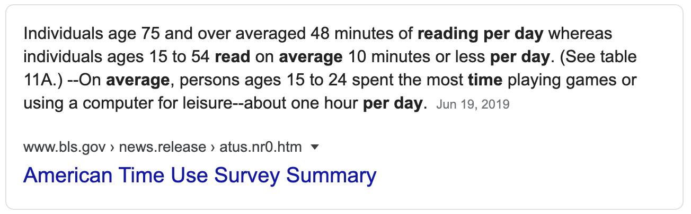

 
 
It is not surprising that the number is so low because these days it is easier to consume through our phone.

*Want to know the latest news?* There is an app for it.

*Want to know the latest trends?* There is an app for it.

*Want to know the summary for a book?* There is an app for it.

Beside it is getting easier to consume everything, there are a lot of infinity apps right now. *Instagram*, *Twitter*, *Youtube*, and many more.

 

I spend around 30-90 minutes a day reading. It is not that much but I make time for it and I don't do it in one sitting. I usually split my reading time because I feel that it is hard to concentrate if I read more than 30 minutes. It took me a long time to build this reading habit, one of the main reason is all of the distractions that I have mentioned above.

I know a lot of people that try to build the same habit. I am sure that it is possible to build a reading habit daily. Imagine by reading only 20 minutes a day you spend more time reading than the average person.

## How to read more?
#### Read books that you like
I used to buy books from people's recommendation. 

> “In my whole life, I have known no wise people (over a broad subject matter area) who didn't read all the time -- none, zero. You'd be amazed at how much Warren reads--and at how much I read. My children laugh at me. They think I'm a book with a couple of legs sticking out.”
― *Charles T. Munger*